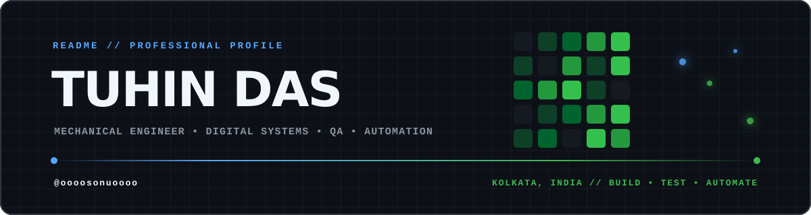

<!-- profile-data-synced: 2026-09-03 -->

  

   

  
  
  
  

  <code>STATUS: ONLINE</code> &nbsp; <code>FOCUS: QUALITY + SYSTEMS</code> &nbsp; <code>MODE: BUILD / TEST / AUTOMATE</code>

---

## About

I’m **Tuhin Das (Sonu)**, an engineering professional based in Kolkata, India. I combine a foundation in mechanical engineering, CNC manufacturing, and quality inspection with hands-on work in Linux systems, software QA, automation, and digital operations.

My work sits at the intersection of physical precision and dependable software: understand the system, find the failure modes, make the workflow simpler, and verify the result.

> **Professional focus:** mechanical engineering · quality assurance · Linux tooling · digital operations · workflow automation

### Quick profile

| | |
| :--- | :--- |
| **Current role** | Business Development Executive · Digital Systems / IT & QA |
| **Academic core** | B.Tech in Mechanical Engineering *(pursuing)* · Diploma in Automobile Engineering *(completed)* |
| **Location** | Kolkata, West Bengal, India |
| **Primary strengths** | Manual QA · systems thinking · requirements engineering · process improvement · technical coordination |

---

## Professional experience

<strong>New Zealand Fresh &amp; Natural (India) Private Limited</strong> — Business Development Executive · Digital Systems / IT &amp; QA · <code>Sep 2025 – Present</code>

 

- Manage day-to-day IT operations, hardware troubleshooting, system upkeep, and technical support for uninterrupted workflows.
- Contribute to the development of **[EthnicBNB](https://ethnicbnb.com/)** by shaping backend booking workflows, running detailed manual tests, identifying functional and usability issues, and recommending system and UI/UX improvements.
- Act as a bridge between developer teams and operational management to translate business requirements into clear technical work and better user flows.
- Support the **[PureMilk](https://puremilk.co.in/)** brand through digital operations, promotional campaigns, marketing collateral, and workflow automation.

**Skills applied:** `Backend workflow design` · `Manual QA` · `UI/UX optimization` · `System administration` · `Requirements engineering` · `IT infrastructure` · `Git` · `Cloud hosting` · `CI/CD automation` · `WhatsApp automation` · `Digital marketing`

<strong>Tata Cummins Private Limited</strong> — Manufacturing Student Trainee · <code>Feb 2024 – Feb 2025</code>

 

- Worked in the machining department with a focus on engine cylinder heads.
- Conducted dimensional, surface-finish, and flaw inspections using precision metrology tools to identify manufacturing defects and maintain accuracy.
- Collaborated with quality-control engineers to audit production parameters, follow standard operating procedures, and maintain high quality standards.

**Skills applied:** `Precision CNC machining` · `Dimensional metrology` · `Quality inspection` · `5S` · `Kaizen` · `Defect analysis`

<strong>Cavi Elettrici e Affini Torino Limited (CEAT)</strong> — Production Engineer (NATS) · <code>Dec 2023 – Feb 2024</code>

 

- Operated high-capacity four-roll calendering machinery, maintaining precise gauge-thickness control at let-off and feed stations.
- Managed raw rubber compound inventory and performed quality validation on textile reinforcement fabrics used in tyre manufacturing.

**Skills applied:** `Process engineering` · `Precision calendering` · `Inventory management` · `Raw-material quality control`

---

## Selected projects

| Project | What it demonstrates | Stack |
| :--- | :--- | :--- |
| [**Wall Blazer**](https://github.com/oooosonuoooo/Wall-Blazer) | GPU-first live wallpaper playlist system with resilient playback and desktop integration | `Python` `GTK` `VLC` |
| [**SysSentinel**](https://github.com/oooosonuoooo/SysSentinel) | Safe resource watchdog and system-monitoring automation | `Python` `Shell` `systemd` |
| [**Universal Controller**](https://github.com/oooosonuoooo/Universal-Controller) | Keyboard-first, AI-assisted terminal control surface and command layer | `Go` `TUI` `HTTP` |
| [**Kali Glass**](https://github.com/oooosonuoooo/kali-brightness) | X11 brightness, gamma, and night-mode controller for Kali Linux | `Python` `PyQt5` `xrandr` |
| [**Kali Splash Pro**](https://github.com/oooosonuoooo/Kali-Splash-Pro) | systemd-based cinematic splash manager for Kali XFCE | `Python` `systemd` `XFCE` |
| [**Kali Auto Update Manager**](https://github.com/oooosonuoooo/Kali-Auto-Update-Manager) | Automated system maintenance and update workflows | `Shell` `Python` `Linux` |
| [**Agent–Obsidian Connection**](https://github.com/oooosonuoooo/agent-obsidian-connection) | Multi-agent coordination and Obsidian synchronization bridge | `Python` `MCP` |
| [**Friday Local LLM**](https://github.com/oooosonuoooo/friday-local-llm) | Local assistant system with voice interaction and PC control | `Python` `LLM` `Automation` |
| [**Cursor Master**](https://github.com/oooosonuoooo/Cursor-Master) | Windows-to-Linux cursor conversion utility | `Python` `Desktop tooling` |

---

## Client and field work

### [EthnicBNB](https://ethnicbnb.com/)

Boutique hospitality and experiential cultural-travel platform.

- Validated full user journeys, booking workflows, reservation integrity, and payment behaviour.
- Discovered, documented, and coordinated high-priority defects with development teams.
- Reviewed UI/UX friction and responsive behaviour across device sizes.
- Supported deployment verification and technical hosting operations.

### [PureMilk](https://puremilk.co.in/)

Direct-to-consumer dairy platform and digital ordering ecosystem.

- Supported storefront operations, technical maintenance, and order-pipeline analysis.
- Reviewed checkout, delivery dispatch, and customer workflow bottlenecks.
- Created and supported promotional campaigns and digital marketing collateral.
- Translated business requirements into technical tasks and script-based automation.

---

## Technical skills

| Domain | Capabilities |
| :--- | :--- |
| **Software & systems** | Linux administration · Kali Linux · Python · Go · Bash · systemd · X11 · GTK · Git · GitHub Actions · Docker · Postman · cloud hosting |
| **Quality & testing** | Manual QA · end-to-end workflow validation · API checks · regression testing · defect discovery · issue reporting · UI/UX review · deployment verification |
| **Manufacturing & quality** | CNC machining · engine-cylinder-head operations · tyre and rubber manufacturing · precision calendering · dimensional gauging · HMI operations · 5S · Kaizen · HIRA · zero-defect QA |
| **AI & automation** | Generative AI · prompt engineering · ChatGPT · Gemini · Claude · MCP protocol · RAG systems · workflow automation · WhatsApp automation |
| **Professional** | Technical leadership · cross-functional collaboration · requirements engineering · problem solving · adaptability · digital marketing |

---

## Education and certifications

| Level | Institution / provider | Programme or status |
| :--- | :--- | :--- |
| **B.Tech** | Techno Engineering College Banipur | Mechanical Engineering · **Pursuing** |
| **Diploma** | Ranaghat Government Polytechnic | Automobile Engineering · **Completed** |
| **Secondary** | Sodepur Chandrachur Vidyapith for Boys | Madhyamik / Class 10 · **Completed** |

**Certifications and training:** `TCS iON Career Edge – Young Professional` · `Turtlemint POSP – General Insurance` · `SolidWorks`

---

## Engineering interests

- Building maintainable Linux utilities and automation tools that remove repetitive work.
- Designing QA workflows that expose edge cases before they reach users.
- Connecting physical engineering discipline with software reliability and clear operations.
- Exploring local AI, agent tooling, and practical human-in-the-loop automation.

---

## GitHub activity

  
  

  
<strong>Contribution graph</strong>

   

  <picture>
    <source media="(prefers-color-scheme: dark)" srcset="https://raw.githubusercontent.com/oooosonuoooo/oooosonuoooo/output/github-contribution-grid-snake-dark.svg">
    <source media="(prefers-color-scheme: light)" srcset="https://raw.githubusercontent.com/oooosonuoooo/oooosonuoooo/output/github-contribution-grid-snake.svg">
    
  </picture>

---

## Contact

If you’re looking for someone who can move between engineering floors, QA scenarios, and Linux systems, let’s talk.

 

**UNDERSTAND · BUILD · TEST · AUTOMATE · REPEAT**

