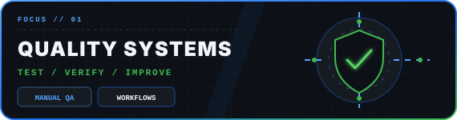
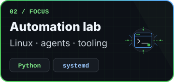

<!-- profile-data-synced: 2026-09-04 -->

  <picture>
    <source media="(max-width: 767px)" srcset="./assets/hero-mobile.svg">
    
  </picture>
   
   
  
  

  <picture>
    <source media="(max-width: 767px)" srcset="./assets/path-mobile.svg">
    
  </picture>

  <picture>
    <source media="(max-width: 767px)" srcset="./assets/stack-mobile.svg">
    
  </picture>
   
  <picture>
    <source media="(max-width: 767px)" srcset="./assets/creative-suite-mobile.svg">
    
  </picture>

  
  
   
  
  

  
  

  <picture>
    <source media="(max-width: 767px)" srcset="./assets/footer-mobile.svg">
    
  </picture>

