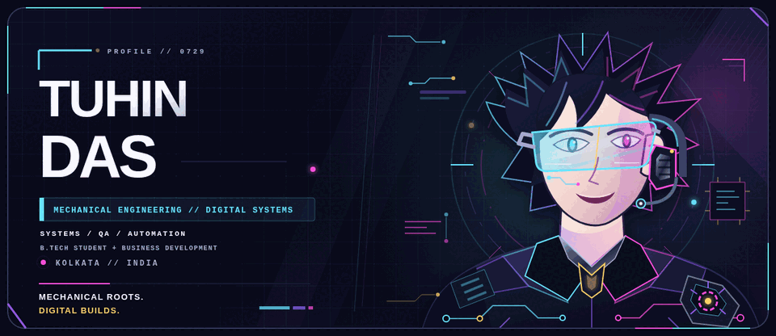
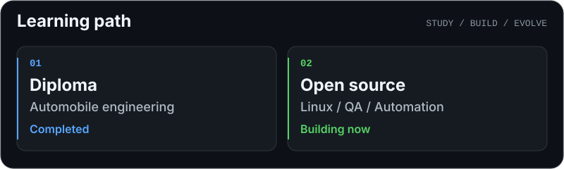
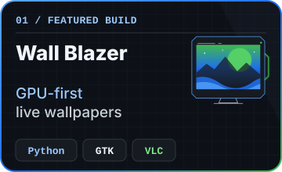
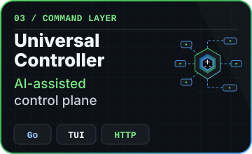
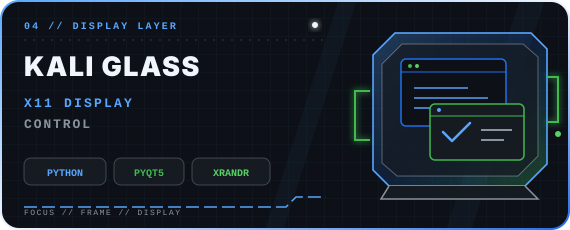
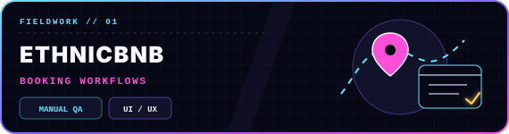
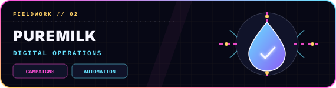
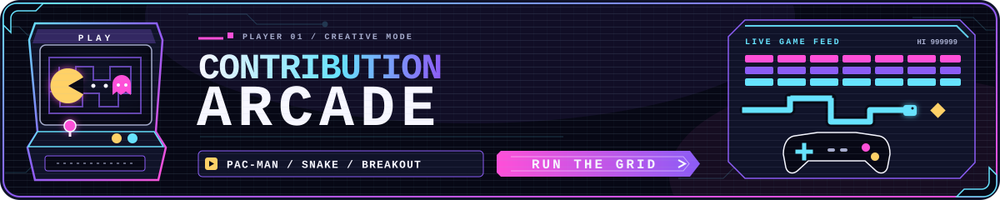

<!-- profile-data-synced: 2026-09-03 -->

  <picture>
    <source media="(prefers-reduced-motion: reduce)" srcset="./assets/hero.svg">
    
  </picture>

   

  
  
  

  

  

  
  
   
  
  

  
  

  

<picture>
  <source media="(prefers-color-scheme: dark)" srcset="https://raw.githubusercontent.com/oooosonuoooo/oooosonuoooo/output/pacman-contribution-graph-dark.svg">
  <source media="(prefers-color-scheme: light)" srcset="https://raw.githubusercontent.com/oooosonuoooo/oooosonuoooo/output/pacman-contribution-graph.svg">
  
</picture>

  
LOAD SNAKE

  <picture>
    <source media="(prefers-color-scheme: dark)" srcset="https://raw.githubusercontent.com/oooosonuoooo/oooosonuoooo/output/github-contribution-grid-snake-dark.svg">
    <source media="(prefers-color-scheme: light)" srcset="https://raw.githubusercontent.com/oooosonuoooo/oooosonuoooo/output/github-contribution-grid-snake.svg">
    
  </picture>

  
LOAD BREAKOUT

  <picture>
    <source media="(prefers-color-scheme: dark)" srcset="https://raw.githubusercontent.com/oooosonuoooo/oooosonuoooo/output/breakout-contribution-graph-dark.svg">
    <source media="(prefers-color-scheme: light)" srcset="https://raw.githubusercontent.com/oooosonuoooo/oooosonuoooo/output/breakout-contribution-graph.svg">
    
  </picture>

  

